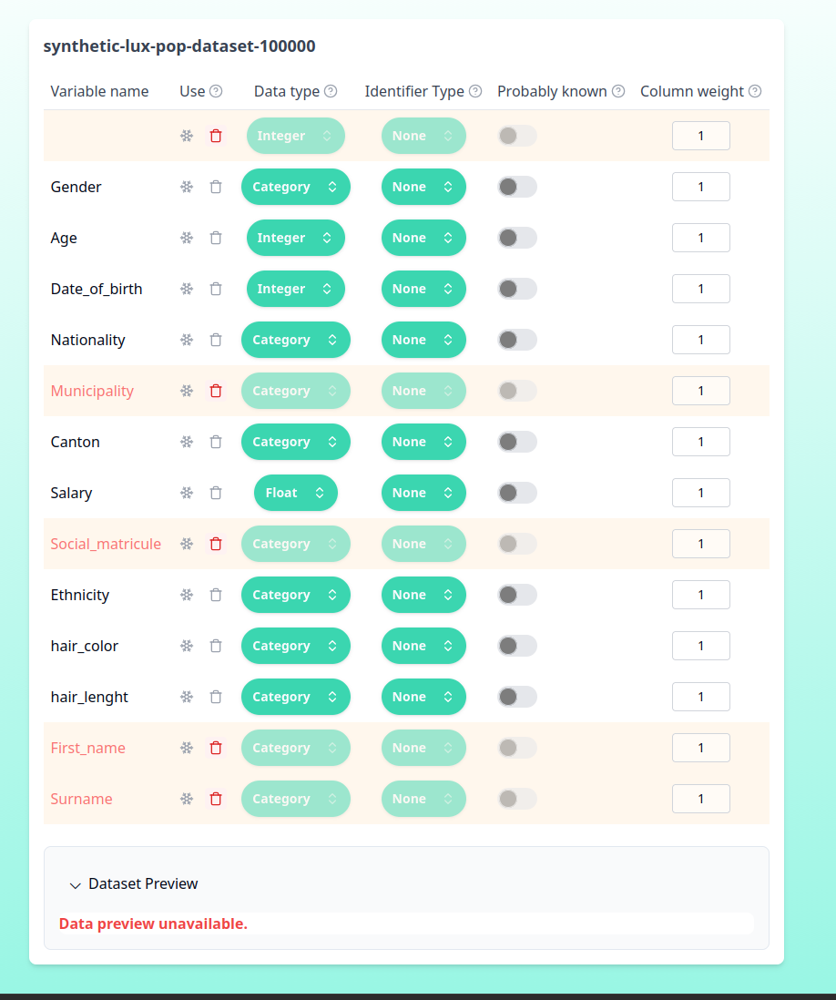
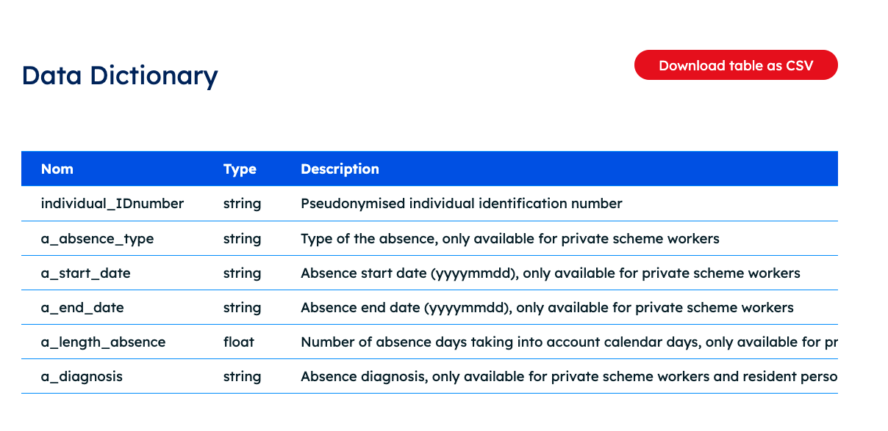
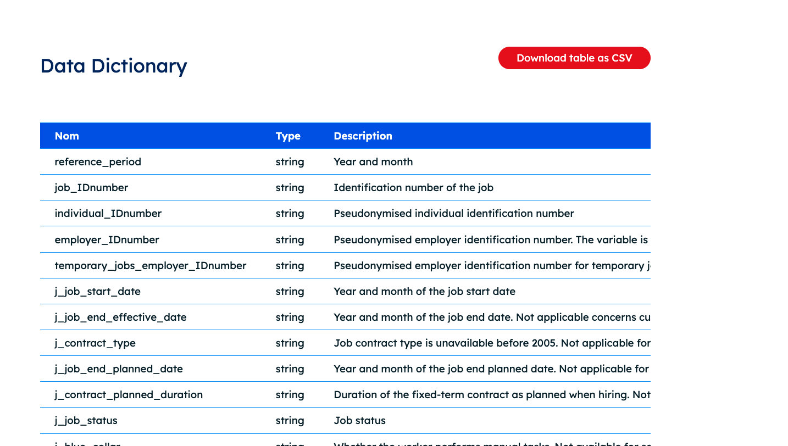
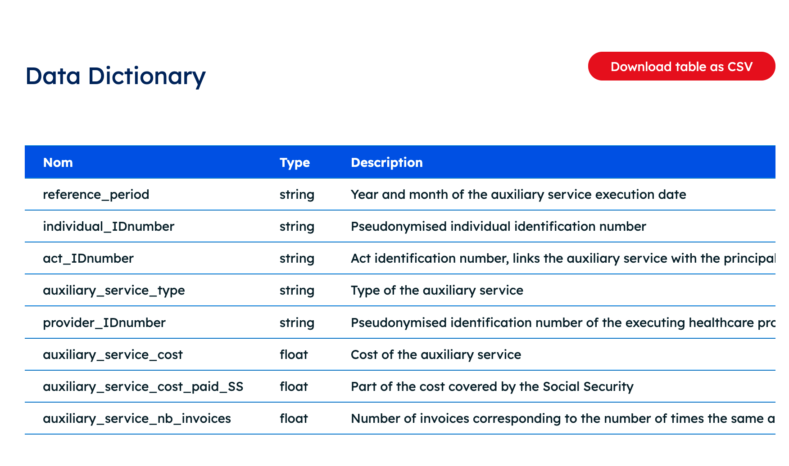

<!-- markdownlint-disable MD033 -->

# Luxembourg Data Exercises

## Repository Structure

```text
exercices-beta/
├── data_source/                # Raw source datasets or metadata
│   ├── Emploi_ville.csv
│   ├── job_characteristic.csv
│   ├── metadata.csv
│   └── synthetic-lux-pop-dataset-100000.csv
├── data_processed/             # Cleaned/prepared datasets for exercises
│   ├── Emploi_ville_processed.csv
│   ├── absence_dataset.csv
│   ├── auxiliary_services_synthetic.csv
│   ├── job_characteristics_dataset.csv
│   └── job_seekers_synthetic_200.csv
├── data_convertor/             # Scripts to generate synthetic datasets
│   ├── absence_generator.py
│   ├── auxiliary_service_generator.py
│   ├── citizen_generator.py
│   ├── emploi_ville.py
│   ├── job_characteristics_generator.py
│   └── job_seeker_generator.py
└── README.md
```

## Introduction

This repository contains a series of practical exercises designed to explore **data anonymisation techniques** applied to realistic Luxembourg administrative and statistical datasets. Each exercise simulates a genuine data access request scenario where researchers, policymakers, or analysts seek sensitive data for legitimate purposes.

**Learning objectives:**

- Understand the trade-offs between data utility and privacy protection
- Apply anonymisation techniques to different data types (demographic, employment, health)
- Handle special coding conventions (missing data, not applicable values)
- Make informed decisions about variable treatment (drop, anonymise, exclude, primary key)

Each exercise includes:

1. **User Query**: A realistic data access request with research objectives
2. **Dataset**: Synthetic data matching Luxembourg's official metadata standards
3. **Anonymisation Approach**: Guided steps and decision points for privacy protection

---

## Synthetic Population (Luxembourg)

### Dataset

- **Source**: <https://data.public.lu/fr/datasets/representative-synthetic-dataset-of-luxembourgs-citizens/>
- **Local file**: [data_source/synthetic-lux-pop-dataset-100000.csv](data_source/synthetic-lux-pop-dataset-100000.csv)

### User Query

A graduate data science student at an engineering school requests access to the Luxembourg synthetic population dataset to study whether hair-related attributes (e.g., hair length) are systematically associated with demographic and socio-economic characteristics.

The goal is to explore plausible correlations.

**Request details:**

- Use the dataset to calibrate models at population level.
- Publish indicators and model outputs.

<details>
<summary>📋 Anonymisation Hints</summary>

- First run: drop only `Unnamed` and `Social matricule`, with `cat2vec` enabled.
- Observation: `cat2vec` features can dominate the embedding/projection.
- Second run: disable `cat2vec` and drop additional variables (see the image below).
- In the projection, three large clusters appear, unexpectedly separated by hair length.
- Hypothesis: some continuous variables were likely generated from normal distributions, creating very sharp clusters.
- Explore column weight on hair attributes.



</details>

---

## Employment by City Dataset

### Dataset

- **Source**: <https://data.public.lu/fr/datasets/r/95a27476-42a1-4ed4-8ea4-3052d3bbb710>
- **Local file**: [data_processed/Emploi_ville_processed.csv](data_processed/Emploi_ville_processed.csv)

### User Query

An analyst from STATEC requests access to the employment-by-city dataset to study regional employment concentration and cross-border commuting patterns.

**Request details:**

- Produce indicators per commune (employment intensity, sector mix) of the current year.
- Support policy work on housing/transport planning and local economic development.

<details>
<summary>📋 Anonymisation Hints</summary>

- Anonymise the `emploi_ville` dataset.
  - Set the `commune` variable as a primary key or exclude variable.
  - Check whether the `cat2vec` parameter is enabled.
- Review the impact on derived/computed variables.
- Inspect the contribution plots.
- Two options:
  - Recompute the derived metrics from the anonymised data.
  - Re-run anonymisation while dropping derived/computed columns.

</details>

---

## Work Absences

### Dataset

- **Source**: <https://letzdata.public.lu/en/catalogue/catalogue-donnees/7/75854412-a5bc-11f0-86a1-8248feeea54e.html>
- **Local file**: [data_processed/absence_dataset.csv](data_processed/absence_dataset.csv)



### User Query

A public health researcher requests access to the absence dataset from the CNPD (Commission Nationale pour la Protection des Données) to analyze workplace health patterns in Luxembourg's private sector.

**Request details:**

- The pseudonymised data will be used solely for statistical research on sick leave trends.
- No re-identification attempts will be made.
- Research aim: to understand absence patterns and provide evidence-based recommendations to the medical sector and health insurance organisations.

<details>
<summary>📋 Anonymisation Hints</summary>

- Apply relative range for date columns or drop them.
- Should we drop individuals with missing absences?
- What about duplicated absences for one individual?
  - Create a multi-table approach?
  - Anonymize as separate individuals?
- Perform both anonymization approaches and compare the metrics.

</details>

---

## Job Characteristics Dataset

### Dataset

- **Source**: <https://letzdata.public.lu/en/catalogue/catalogue-donnees/1/1d899f82-caac-11f0-a122-8aadbbc611c1.html>
- **Local file**: [data_source/job_characteristic.csv](data_source/job_characteristic.csv)
- **Features**:
  - 4,000+ individuals with job records (wages, working hours, contract types).
  - Private-sector workers, civil servants, and self-employed.
  - Realistic distribution: ~70% permanent contracts; wages range from minimum wage to executive levels.
  - Special statuses: maternity leave, activation measures (ADEM), short-time working (chômage partiel).



### User Query

A labor economist from the Central Bank of Luxembourg (BCL) requests access to the job characteristics dataset to conduct macroeconomic analysis of the Luxembourg labor market.

**Request details:**

- Analyse employment dynamics, wage evolution, and contract types across sectors (2015–2026).
- Study the prevalence of part-time work, overtime, and short-time working arrangements.
- Research aim: evaluate labor-market flexibility, wage competitiveness, and the impact of economic shocks on employment contracts.
- Outputs will be aggregated at sector level to produce quarterly labor-market indicators for monetary policy assessment.

<details>
<summary>📋 Anonymisation Hints</summary>

- Replace -9 by NaN, explain the differences if this is not done.
- What data types should be used for each variable?

</details>

---

## Auxiliary Services Related to Medical Acts

### Dataset

- **Source**: <https://letzdata.public.lu/en/catalogue/catalogue-donnees/1/1fe064f0-caac-11f0-a122-8aadbbc611c1.html>



### User Query

A health economist from the Luxembourg Institute of Socio-Economic Research (LISER) requests access to the auxiliary services dataset to study healthcare utilization efficiency and cost patterns.

**Request details:**

- Analyse auxiliary service usage trends (physiotherapy, lab tests, imaging) from 2020–2025.
- Evaluate Social Security reimbursement patterns and patient out-of-pocket costs.
- Research aim: identify potential inefficiencies in auxiliary service delivery and inform health policy on optimal resource allocation.
- The pseudonymised data will be used exclusively for academic research with strict confidentiality protocols.

<details>
<summary>📋 Anonymisation Hints</summary>

- Review the period columns. What approach should be used?
  - Drop the columns? Anonymize as integer? Anonymize as categorical? Convert to datetime?
- Set act ID as primary key.
- Use individual ID as categorical variable.
- Start the anonymization.

</details>

## Resources

- <https://data.public.lu/fr/pages/topics/statistics>
